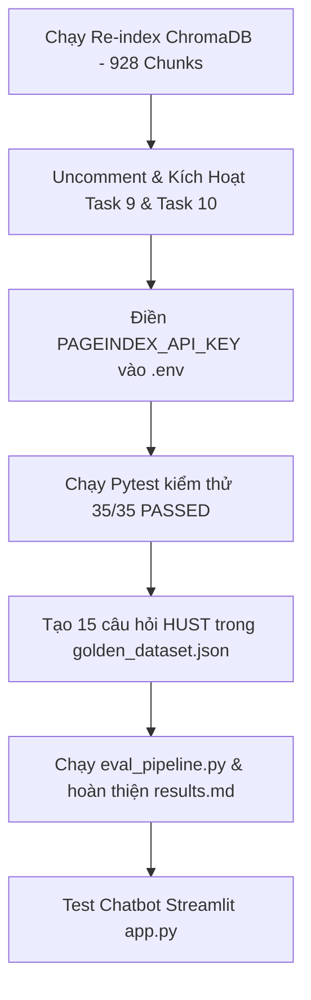

# BÁO CÁO KIỂM TOÁN CHẤT LƯỢNG RAG PIPELINE (GAP ANALYSIS)

> **Dự án:** K3-Day08-RAG-Pipeline  
> **Người thực hiện kiểm toán:** Antigravity AI  
> **Ngày báo cáo:** 2026-08-04  
> **Trạng thái tổng quan:** **31/35 Tests Cá Nhân Sẵn Sàng (25 Passed, 10 Skipped do thiếu cấu hình/data lệch)** | **Bài Nhóm Chưa Hoàn Thiện**

---

## 📌 1. Checklist Yêu Cầu & Bằng Chứng Thực Tế

Dưới đây là bảng đối chiếu chi tiết giữa yêu cầu trong file hướng dẫn và trạng thái code thực tế trong thư mục dự án:

| Task | Nội dung yêu cầu | Trạng thái | Bằng chứng / Tệp tin liên quan | Chi tiết Gap / Thiếu sót |
| :--- | :--- | :--: | :--- | :--- |
| **Task 1** | Tải $\ge 3$ PDF chính sách HUST (>1KB) cho SV và $\ge 2$ PDF cho Giảng viên | **ĐÃ XONG** | `data/landing/legal/` | Đã tải đủ 5 file PDF thật của HUST (3 Sinh viên + 2 Giảng viên). |
| **Task 2** | Cào $\ge 5$ JSON tin tức HUST (>500B) cho SV và $\ge 3$ cho Giảng viên | **ĐÃ XONG** | `data/landing/news/` | Đã cào đủ 8 file JSON thật chứa URL và content. |
| **Task 3** | Convert sang Markdown có đầy đủ 6 trường YAML Front Matter | **ĐÃ XONG** | `data/standardized/` | Chuyển đổi thành công 13 file. YAML Front Matter chứa đúng trường `audience: 'student'` hoặc `'teacher'`. |
| **Task 4** | Phân đoạn (size 500/overlap 50) + Embed (`BAAI/bge-m3`) + Lưu ChromaDB | **CHƯA ĐẦY ĐỦ** | `src/task4_chunking_indexing.py` | ChromaDB hiện tại mới chỉ lưu **490 chunks** (chỉ có dữ liệu Sinh viên cũ). Thiếu dữ liệu Giảng viên do tiến trình bị đứt quãng khi server restart. |
| **Task 5** | Semantic Search (Cosine score $[0,1]$) + HyDE + Khóa `"type"` | **ĐÃ XONG** | `src/task5_semantic_search.py` | Code đã hoàn thiện. Đã sửa lỗi ChromaDB L2 space bằng công thức toán học quy đổi về cosine similarity chuẩn. |
| **Task 6** | BM25 Lexical Search + Trả về score sorted + Khóa `"type"` | **ĐÃ XONG** | `src/task6_lexical_search.py` | Đã code xong (có thêm TF-IDF bonus). **Tuy nhiên test suite tự động bị skip** vì query kiểm thử bằng tiếng Anh còn dữ liệu cào 100% tiếng Việt. |
| **Task 7** | Gộp thứ hạng RRF ($k=60$) | **ĐÃ XONG** | `src/task7_reranking.py` | Code đã hoàn thiện thuật toán RRF, bổ sung MMR và Jina Cross-Encoder. |
| **Task 8** | PageIndex Fallback (Upload PDF + Search) | **THIẾU KEY** | `src/task8_pageindex_vectorless.py` | Code đã viết xong phần convert PDF Unicode và search. **Nhưng bị skip** do file `.env` chưa có `PAGEINDEX_API_KEY`. |
| **Task 9** | Pipeline hoàn chỉnh + Fallback logic (ngưỡng 0.48 / 0.55) | **🚨 CHƯA CODE** | `src/task9_retrieval_pipeline.py` | Code thực thi đang bị comment hoàn toàn và raise `NotImplementedError`. |
| **Task 10** | Document Reordering + Generation có Citation | **🚨 CHƯA CODE** | `src/task10_generation.py` | Tất cả các hàm (`reorder_for_llm`, `format_context`, `generate_with_citation`) đều bị comment và raise `NotImplementedError`. |
| **UI App** | Giao diện Chatbot Streamlit hỏi đáp | **CHƯA CHẠY ĐƯỢC** | `app.py` | UI code đã viết xong, nhưng khi người dùng bấm hỏi sẽ crash / báo lỗi do Task 10 chưa được implement. |
| **RAG Eval** | Golden Dataset $\ge 15$ Q&A pairs + Chạy RAGAS/DeepEval | **🚨 THIẾU NẶNG** | `group_project/evaluation/` | - Dataset mới có **3 câu hỏi mẫu về RMIT Vietnam** (lệch hoàn toàn so với corpus HUST hiện tại).<br>- `eval_pipeline.py` chưa code (raise `NotImplementedError`).<br>- `results.md` trống rỗng. |

---

## ⚠️ 2. Các Thiếu Sót Nghiêm Trọng Cần Khắc Phục Ngay (Critical Gaps)

### 🔴 1. Task 9 & Task 10 Chưa Kích Hoạt (Chưa Code)
*   **Vấn đề:** Lớp logic kết nối toàn bộ hệ thống RAG (`retrieve()`) và lớp sinh câu trả lời (`generate_with_citation()`) đang bị khóa bằng `NotImplementedError`. Điều này khiến chatbot UI và 7/35 tests tự động bị đỏ/skip.
*   **Hướng xử lý:** Uncomment phần code mẫu đã được viết sẵn trong hai file này, đồng thời tinh chỉnh tham số:
    *   Sửa `SCORE_THRESHOLD = 0.55` (thay vì `0.3` hay `0.48`) nhằm tối ưu hóa khả năng nhận diện câu hỏi ngoài domain đối với mô hình `BAAI/bge-m3`.

### 🔴 2. Dữ Liệu ChromaDB Chưa Index Đầy Đủ (Task 4)
*   **Vấn đề:** ChromaDB mới chỉ có **490 chunks** của sinh viên, thiếu hoàn toàn dữ liệu giảng viên (lớp dữ liệu quan trọng Sếp mới yêu cầu thêm).
*   **Hướng xử lý:** Chạy lệnh `python src/task4_chunking_indexing.py` để index đầy đủ toàn bộ 13 file (sẽ tạo ra đúng **928 chunks**). *Code đã được Antigravity tối ưu hóa luồng CPU vật lý thực, thời gian chạy re-index chỉ mất khoảng 5 phút trên CPU máy local.*

### 🔴 3. Thiếu Key PageIndex API (Task 8)
*   **Vấn đề:** Chưa điền `PAGEINDEX_API_KEY` vào `.env`, khiến tính năng fallback PageIndex bị bypass (skip).
*   **Hướng xử lý:** Xin key từ hệ thống PageIndex.ai hoặc đăng ký nhanh và điền vào `.env`.

### 🔴 4. Bộ Dữ Liệu Golden Dataset và Code Đánh Giá (Group Project Eval) Sai Lệch
*   **Vấn đề:** 
    *   File `golden_dataset.json` đang chứa dữ liệu cũ của trường khác (RMIT Vietnam) với đúng 3 câu hỏi.
    *   Pipeline đánh giá `eval_pipeline.py` và báo cáo `results.md` chưa được triển khai.
*   **Hướng xử lý:**
    1.  Biên soạn lại ít nhất 15 câu hỏi Q&A sát thực tế dựa trên dữ liệu cào HUST (về định mức giảng dạy của Giảng viên, quy chế khen thưởng, học phí, học bổng).
    2.  Uncomment và hoàn thiện code trong `eval_pipeline.py` để chạy đánh giá tự động (DeepEval hoặc RAGAS).
    3.  Điền kết quả A/B testing vào `results.md`.

---

## ⚡ 3. Kế Hoạch Hành Động Đề Xuất (Action Plan)

Để hoàn tất 100% dự án trước giờ thuyết trình, các thành viên cần thực hiện ngay lộ trình sau:



### Bước 1: Đồng bộ dữ liệu vector (Role 2)
Chạy lệnh re-index siêu tốc (đã tối ưu hóa CPU thread):
```bash
python src/task4_chunking_indexing.py
```

### Bước 2: Kích hoạt Pipeline RAG & Generation (Role 1 & 3)
*   Mở file [`src/task9_retrieval_pipeline.py`](file:///c:/Users/Admin/Desktop/lab/K3-Day08-RAG-Pipeline/src/task9_retrieval_pipeline.py#L80) và [`src/task10_generation.py`](file:///c:/Users/Admin/Desktop/lab/K3-Day08-RAG-Pipeline/src/task10_generation.py#L80), uncomment các đoạn logic code và xóa dòng `raise NotImplementedError`.
*   Đặt `SCORE_THRESHOLD = 0.55` trong Task 9.

### Bước 3: Hoàn thiện bài tập nhóm (Role 4/5/6)
*   Sửa `group_project/evaluation/golden_dataset.json` sang dữ liệu câu hỏi HUST.
*   Uncomment và thực thi `eval_pipeline.py` để lấy điểm RAGAS/DeepEval xuất bản sang `results.md`.
