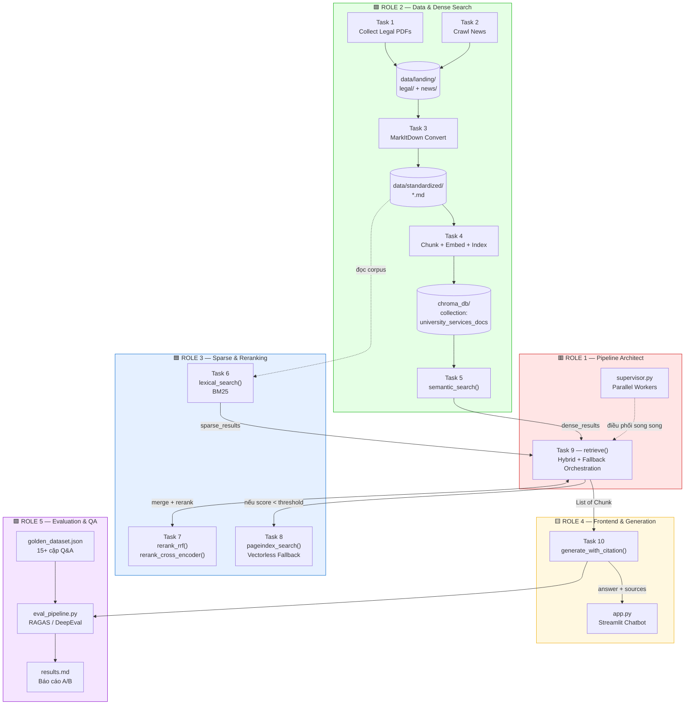

# 🏛️ Kiến Trúc Hệ Thống & Quy Ước Làm Việc Nhóm

### Lab 08 — University Services RAG Pipeline v2

> **Mục đích của tài liệu này:** để 5 thành viên code **độc lập, song song, không chờ nhau**, nhưng khi ghép lại thì chạy được ngay lần đầu.
>
> Nguyên tắc cốt lõi: **mọi người code theo *hợp đồng dữ liệu* (data contract), không code theo *code của người khác*.**
> Bạn không cần biết đồng đội implement thế nào — bạn chỉ cần biết hàm của họ **nhận gì** và **trả ra gì**.

---

## 📑 Mục Lục

1. [Kiến trúc hệ thống](#1-kiến-trúc-hệ-thống)
2. [Hợp đồng dữ liệu — LUẬT BẤT BIẾN](#2-hợp-đồng-dữ-liệu--luật-bất-biến)
3. [Bảng phân chia quyền sở hữu file](#3-bảng-phân-chia-quyền-sở-hữu-file)
4. [3 cái bẫy tích hợp đã phát hiện trong starter code](#4--3-cái-bẫy-tích-hợp-đã-phát-hiện-trong-starter-code)
5. [Quy trình làm việc độc lập (Stub-First)](#5-quy-trình-làm-việc-độc-lập-stub-first)
6. [Quy ước Git & thứ tự merge](#6-quy-ước-git--thứ-tự-merge)
7. [Timeline theo Checkpoint](#7-timeline-theo-checkpoint)
8. [Definition of Done & Checklist bàn giao](#8-definition-of-done--checklist-bàn-giao)
9. [Kịch bản tích hợp cuối (Integration Day)](#9-kịch-bản-tích-hợp-cuối-integration-day)
10. [Phụ lục: Lệnh chạy nhanh](#10-phụ-lục-lệnh-chạy-nhanh)

---

## 1. Kiến Trúc Hệ Thống

### 1.1 Sơ đồ tổng thể



### 1.2 Luồng dữ liệu runtime (khi user hỏi 1 câu)

```
User Query
    │
    ├──────────────┬──────────────┐
    ▼              ▼              │
semantic_search  lexical_search   │   ← chạy SONG SONG (Role 2 + Role 3)
(dense, cosine)  (sparse, BM25)   │
    │              │              │
    │  top_k*2     │  top_k*2     │
    └──────┬───────┘              │
           ▼                      │
     rerank_rrf([dense, sparse])  │   ← Role 3 gộp 2 danh sách
           │                      │
           ▼                      │
     rerank(cross_encoder/mmr)    │   ← Role 3 (tuỳ chọn)
           │                      │
           ▼                      │
   ┌───────────────────────────┐  │
   │ GATE: dense_results[0]    │◄─┘   ← Role 1 quyết định
   │ ["score"] < THRESHOLD ?   │        (dùng điểm COSINE GỐC, không phải điểm RRF)
   └───────────┬───────────────┘
       NO ─────┴───── YES
        │             │
        ▼             ▼
  source="hybrid"  pageindex_search()   ← Role 3 (vectorless fallback)
        │          source="pageindex"
        └──────┬──────┘
               ▼
        reorder_for_llm()      ← Role 4 (chống "lost in the middle")
               ▼
        format_context()       ← Role 4 (gắn nhãn [Document i | Source: ...])
               ▼
        LLM (OpenRouter)       ← Role 4
               ▼
   { answer, sources, retrieval_source }
               ▼
        Streamlit UI           ← Role 4
               ▼
        RAGAS Evaluation       ← Role 5
```

### 1.3 Ranh giới kiến trúc (Architectural Boundaries)

| Tầng | Ai sở hữu | Không được phép |
|---|---|---|
| **Ingestion** (T1–T3) | Role 2 | Không ai khác ghi vào `data/` |
| **Index** (T4) | Role 2 | Không ai khác đổi `EMBEDDING_MODEL`, `COLLECTION_NAME` |
| **Retriever** (T5, T6, T7, T8) | Role 2 + Role 3 | Không được import lẫn nhau giữa T5 ↔ T6 |
| **Orchestration** (T9, supervisor) | Role 1 | **Chỉ Role 1** được sửa `task9`. Đây là điểm hợp long duy nhất. |
| **Generation + UI** (T10, app.py) | Role 4 | Chỉ được gọi `retrieve()`, không gọi thẳng T5/T6/T7 |
| **Evaluation** (group_project/) | Role 5 | Chỉ được gọi `generate_with_citation()` và `retrieve()` |

> ⚠️ **Quy tắc vàng:** Role 4 và Role 5 **tuyệt đối không** import `task5/6/7/8`. Họ chỉ biết đến `retrieve()` và `generate_with_citation()`. Điều này giữ cho Role 1/2/3 tự do refactor bên trong mà không làm vỡ UI/eval.

---

## 2. Hợp Đồng Dữ Liệu — LUẬT BẤT BIẾN

> Đây là phần **quan trọng nhất** của tài liệu. Nếu cả nhóm tuân thủ đúng mục 2 này, việc ghép code sẽ mất **< 15 phút**. Nếu không, sẽ mất cả buổi để debug.

### 2.1 `Chunk` — kiểu dữ liệu xương sống của toàn hệ thống

Mọi hàm retrieval (`semantic_search`, `lexical_search`, `rerank_*`, `pageindex_search`, `retrieve`) đều **nhận và trả về `list[Chunk]`**, trong đó:

```python
Chunk = {
    "content":  str,    # BẮT BUỘC. Nội dung text của chunk.
                        # ⚠️ Đây là KHOÁ ĐỊNH DANH dùng để dedupe trong RRF.
    "score":    float,  # BẮT BUỘC. Điểm số. Ý nghĩa TÙY TẦNG (xem 2.2).
    "metadata": {       # BẮT BUỘC (có thể rỗng {} nhưng key phải tồn tại)
        "source":      str,  # tên file gốc, vd "tuition-fees-rmit.pdf"
        "type":        str,  # "legal" | "news"      ⚠️ KEY LÀ "type", KHÔNG PHẢI "doc_type"
        "chunk_index": int,  # vị trí chunk trong document gốc
    },
    # Chỉ xuất hiện ở OUTPUT của retrieve() (Task 9):
    "source": str,      # "hybrid" | "pageindex"    ⚠️ Đây là key TOP-LEVEL,
                        #    khác hoàn toàn với metadata["source"]
}
```

**Ba cái bẫy đặt tên phải nhớ:**

| Nhầm lẫn | Đúng | Sai |
|---|---|---|
| Loại tài liệu | `chunk["metadata"]["type"]` | ~~`metadata["doc_type"]`~~ |
| Tên file nguồn | `chunk["metadata"]["source"]` | — |
| Nguồn retrieval | `chunk["source"]` (top-level) | ~~`metadata["source"]`~~ |

> 📌 Docstring của Task 5 trong starter viết `doc_type`, nhưng Task 4 và Task 10 đều dùng `type`.
> **Chốt cả nhóm: dùng `"type"`.** Role 2 sửa lại docstring Task 5 cho khớp.

### 2.2 Ý nghĩa của `score` thay đổi theo tầng — CỰC KỲ QUAN TRỌNG

| Sau bước | `score` là gì | Khoảng giá trị | Có so sánh được với threshold không? |
|---|---|---|---|
| `semantic_search()` | Cosine similarity | `0.0 → 1.0` | ✅ **CÓ** — đây là điểm duy nhất dùng cho gate |
| `lexical_search()` | BM25 raw score | `0.0 → ~20+` (không chuẩn hoá) | ❌ KHÔNG |
| `rerank_rrf()` | RRF score `Σ 1/(k+rank)` | `~0.008 → ~0.033` | ❌ **KHÔNG** (luôn rất nhỏ!) |
| `rerank_cross_encoder()` | Relevance score | `0.0 → 1.0` | ⚠️ Khác thang đo với cosine |
| `pageindex_search()` | Relevance từ API | tuỳ API | ❌ KHÔNG |

> 🔥 **Đây là lỗi kinh điển của lab này:** RRF score luôn nằm quanh `0.016` (= `1/60`). Nếu Role 1 so sánh `merged[0]["score"] < 0.3` thì hệ thống sẽ **LUÔN LUÔN** rơi vào fallback PageIndex, và hybrid search coi như vô dụng.
>
> ✅ **Bắt buộc:** Task 9 phải giữ biến `dense_results` riêng và so sánh `dense_results[0]["score"]` với threshold — **trước** khi RRF ghi đè `score`.

### 2.3 Hợp đồng output của `generate_with_citation()` (Role 4 → Role 5, UI)

```python
{
    "answer":           str,          # câu trả lời tiếng Việt, có trích dẫn [Document 1]
    "sources":          list[Chunk],  # đúng các chunks đã đưa vào prompt
    "retrieval_source": str,          # "hybrid" | "pageindex"
}
```

Role 5 build `eval_pipeline.py` dựa **chính xác** trên 3 key này. RAGAS cần:
- `answer` → metric Faithfulness, Answer Relevancy
- `[c["content"] for c in sources]` → metric Context Precision, Context Recall

### 2.4 Quy ước xử lý lỗi & rỗng

| Tình huống | Hành vi BẮT BUỘC |
|---|---|
| Không tìm thấy kết quả | `return []` — **không** raise, **không** return `None` |
| Thiếu API key (T8, T10) | Print cảnh báo + `return []` (T8) / trả `answer` báo lỗi thân thiện (T10) |
| Vector store chưa index | Raise `RuntimeError` với message rõ ràng: `"Chưa chạy task4, hãy chạy: python -m src.task4_chunking_indexing"` |
| Chunk không có metadata | Dùng `chunk.get("metadata", {})` — **luôn dùng `.get()`**, không index trực tiếp |

---

## 3. Bảng Phân Chia Quyền Sở Hữu File

> **Luật:** Mỗi file có **đúng 1 chủ sở hữu**. Muốn sửa file không thuộc về mình → nhắn chủ sở hữu, không tự sửa. Đây là cách tránh 90% merge conflict.

| Role | Tên | 🔒 File SỞ HỮU (được ghi) | 👁️ File CHỈ ĐỌC (được import) |
|---|---|---|---|
| **1** | Team Leader & RAG Architect | `src/task9_retrieval_pipeline.py`<br>`src/supervisor.py` *(chưa tồn tại — phải tạo mới)*<br>`README.md`, `TEAM_ARCHITECTURE.md` | `task5`, `task6`, `task7`, `task8` |
| **2** | Data & Dense Search | `src/task1_collect_legal_docs.py`<br>`src/task2_crawl_news.py`<br>`src/task3_convert_markdown.py`<br>`src/task4_chunking_indexing.py`<br>`src/task5_semantic_search.py`<br>`data/**`, `chroma_db/**` | — |
| **3** | Sparse Search & Reranking | `src/task6_lexical_search.py`<br>`src/task7_reranking.py`<br>`src/task8_pageindex_vectorless.py` | `data/standardized/**` (đọc corpus) |
| **4** | Frontend & Chatbot | `src/task10_generation.py`<br>`app.py` | `task9.retrieve` **duy nhất** |
| **5** | Evaluation & QA | `group_project/evaluation/golden_dataset.json`<br>`group_project/evaluation/eval_pipeline.py`<br>`group_project/evaluation/results.md`<br>`tests/test_individual.py` *(nếu cần bổ sung)* | `task9.retrieve`, `task10.generate_with_citation` |

### File dùng chung — cần thông báo trước khi sửa

| File | Ai được sửa | Quy trình |
|---|---|---|
| `requirements.txt` | Ai cũng được **thêm dòng** | Chỉ THÊM, không XOÁ dòng của người khác. Báo group chat. |
| `.env.example` | Ai cũng được thêm key | Thêm key mới → báo cả nhóm cập nhật `.env` local |
| `README.md` | Role 1 | Người khác gửi nội dung cho Role 1 |

---

## 4. ⚠️ 3 Cái Bẫy Tích Hợp Đã Phát Hiện Trong Starter Code

> Đây là các mâu thuẫn **có thật** trong repo hiện tại. Nhóm phải chốt phương án **ngay ở Checkpoint 0**, trước khi ai code.

### 🪤 Bẫy #1 — `rerank(method="rrf")` sẽ CRASH

**Vấn đề:** File [src/task7_reranking.py:157](src/task7_reranking.py#L157) định nghĩa `rerank()` với `method="rrf"` → nhưng nhánh `rrf` lại `raise NotImplementedError("Call rerank_rrf with ranked_lists")`.

Trong khi đó [src/task9_retrieval_pipeline.py:44](src/task9_retrieval_pipeline.py#L44) đặt `RERANK_METHOD = "rrf"` và code gợi ý gọi `rerank(query, merged, top_k, method=RERANK_METHOD)`.

👉 **Ghép nguyên xi = crash ngay.**

**✅ Phương án chốt:**
- RRF là bước **merge** (nhận *nhiều* ranked lists), không phải bước **rerank** (nhận *một* candidate list). Hai thứ này khác nhau về bản chất.
- Task 9 gọi `rerank_rrf([dense, sparse])` **trực tiếp** để merge.
- Sau đó, nếu `use_reranking=True`, gọi `rerank(query, merged, method="cross_encoder")`.
- **Role 1 đổi** `RERANK_METHOD = "cross_encoder"` trong Task 9.
- **Role 3 sửa** nhánh `"rrf"` trong `rerank()` thành thông báo lỗi rõ nghĩa:
  ```python
  raise ValueError("RRF là bước merge nhiều ranked lists — hãy gọi rerank_rrf() trực tiếp, không qua rerank().")
  ```

---

### 🪤 Bẫy #2 — Threshold fallback: `0.3` hay `0.48`?

**Vấn đề:** [src/task9_retrieval_pipeline.py:42](src/task9_retrieval_pipeline.py#L42) đặt `SCORE_THRESHOLD = 0.3`, nhưng `LAB_GUIDE.md` (Checkpoint 3) lại yêu cầu trình bày *"bẫy điều kiện Fallback (Cosine < 0.48)"*.

**✅ Phương án chốt:** **Không copy con số nào cả — phải tự đo.**

Role 1 + Role 2 làm chung 5 phút ở CP3:
```python
# Chạy sau khi Task 4 + Task 5 xong
from src.task5_semantic_search import semantic_search

in_domain  = ["Học phí RMIT bao nhiêu?", "Điều kiện học bổng?", "Ký túc xá có không?"]
out_domain = ["Cách nấu phở bò?", "Giá Bitcoin hôm nay?", "Thời tiết Hà Nội?"]

for q in in_domain:  print("IN ", round(semantic_search(q, 1)[0]["score"], 3), q)
for q in out_domain: print("OUT", round(semantic_search(q, 1)[0]["score"], 3), q)
```
→ Chọn threshold nằm **giữa** min(in_domain) và max(out_domain). Ghi con số + lý do vào comment Task 9 và vào `results.md`.

> 💡 Đây chính là điểm coach hay hỏi ở CP3. Nhóm nào giải thích được "tụi em đo được in-domain ~0.62, out-domain ~0.31 nên chọn 0.45" sẽ ăn điểm.

---

### 🪤 Bẫy #3 — `src/supervisor.py` KHÔNG TỒN TẠI

`README.md` liệt kê `src/supervisor.py` trong cây thư mục, nhưng file này **chưa có trong repo**.

**✅ Role 1 phải tạo mới.** Đây là phần "Pattern nâng cao" — không nằm trong 35 test của `test_individual.py`, nhưng là điểm cộng khi demo.

Khung gợi ý (chạy dense + sparse **thật sự song song**, không tuần tự):

```python
"""supervisor.py — Supervisor + Parallel Workers pattern."""
from concurrent.futures import ThreadPoolExecutor

from .task5_semantic_search import semantic_search
from .task6_lexical_search import lexical_search
from .task7_reranking import rerank_rrf


def parallel_retrieve(query: str, top_k: int = 10) -> dict[str, list[dict]]:
    """Supervisor điều phối 2 worker chạy song song, trả kết quả tách biệt."""
    with ThreadPoolExecutor(max_workers=2) as pool:
        futures = {
            "dense":  pool.submit(semantic_search, query, top_k),
            "sparse": pool.submit(lexical_search, query, top_k),
        }
        results = {}
        for name, fut in futures.items():
            try:
                results[name] = fut.result(timeout=30)
            except Exception as e:      # worker chết không được kéo sập supervisor
                print(f"  ⚠ Worker '{name}' lỗi: {e}")
                results[name] = []
    return results
```

> Task 9 có thể dùng `parallel_retrieve()` thay cho 2 lời gọi tuần tự — **nhưng chỉ sau khi bản tuần tự đã pass test**. Đừng tối ưu trước khi chạy đúng.

---

## 5. Quy Trình Làm Việc Độc Lập (Stub-First)

### 5.1 Nguyên tắc: KHÔNG AI ĐƯỢC CHỜ AI

Vấn đề kinh điển: *"Em chưa code được Task 9 vì bạn Role 3 chưa xong Task 7."*
→ Sai. Với hợp đồng dữ liệu ở Mục 2, bạn code được **ngay lập tức**.

### 5.2 Mỗi người tạo file fixture riêng để tự test

Tạo `tests/fixtures.py` (Role 1 tạo ở CP0, cả nhóm dùng chung):

```python
"""fixtures.py — Dữ liệu giả tuân thủ Chunk contract, để mọi role test độc lập."""

FAKE_CHUNKS = [
    {
        "content": "Học phí chương trình Business tại RMIT Vietnam khoảng 375.840.000 VND mỗi năm.",
        "score": 0.87,
        "metadata": {"source": "tuition-fees-rmit.md", "type": "legal", "chunk_index": 0},
    },
    {
        "content": "Học phí được thanh toán theo từng học kỳ, tính trên số môn đã đăng ký.",
        "score": 0.79,
        "metadata": {"source": "tuition-fees-rmit.md", "type": "legal", "chunk_index": 1},
    },
    {
        "content": "RMIT không cung cấp ký túc xá trong khuôn viên, nhưng có đội hỗ trợ tìm chỗ ở.",
        "score": 0.71,
        "metadata": {"source": "accommodation-rmit.md", "type": "legal", "chunk_index": 0},
    },
    {
        "content": "Sinh viên đặt phòng học nhóm tại thư viện qua hệ thống booking online.",
        "score": 0.64,
        "metadata": {"source": "library-services.md", "type": "news", "chunk_index": 2},
    },
    {
        "content": "Học bổng Academic Achievement yêu cầu điểm trung bình xuất sắc và bài luận.",
        "score": 0.58,
        "metadata": {"source": "scholarship-rmit.md", "type": "legal", "chunk_index": 0},
    },
]


def fake_retrieve(query: str, top_k: int = 5, **kwargs) -> list[dict]:
    """Stub của task9.retrieve() — dùng khi Task 9 chưa xong."""
    return [{**c, "source": "hybrid"} for c in FAKE_CHUNKS[:top_k]]
```

### 5.3 Cách từng role dùng stub để không bị block

| Role | Bị chặn bởi | Cách gỡ chặn ngay |
|---|---|---|
| **Role 1** (T9) | T5, T6, T7, T8 chưa xong | Import `FAKE_CHUNKS`, tự viết `rrf` tạm 10 dòng để kiểm tra luồng if/else + threshold gate. Thay bằng hàng thật khi Role 2/3 push. |
| **Role 3** (T6) | Chưa có `data/standardized/` | Tự tạo 3 file `.md` giả trong thư mục đó để build BM25. **Xoá đi** trước khi merge — dữ liệu thật là của Role 2. |
| **Role 3** (T7) | Chưa có candidates thật | `rerank_rrf` chỉ là toán học thuần — test bằng 2 list `FAKE_CHUNKS` xáo trộn thứ tự, không cần gì khác. |
| **Role 4** (T10) | T9 chưa xong | `from tests.fixtures import fake_retrieve as retrieve` — đổi 1 dòng import khi ghép. |
| **Role 4** (app.py) | T10 chưa xong | Hardcode dict `{"answer": "...", "sources": FAKE_CHUNKS, "retrieval_source": "hybrid"}` — build toàn bộ UI trước. |
| **Role 5** (eval) | Cả pipeline chưa xong | `eval_pipeline.py` nhận `rag_pipeline` là **tham số callable**, không import cứng. Truyền `fake_retrieve` vào để test RAGAS chạy được. Golden dataset 15 câu viết được ngay từ phút 0 chỉ cần đọc `data/`. |

> 🎯 **Ý tưởng then chốt:** `eval_pipeline.py` đã được thiết kế đúng — `evaluate_with_ragas(rag_pipeline, golden_dataset)` nhận pipeline làm **tham số**. Role 5 giữ nguyên thiết kế này, tuyệt đối không đổi thành import trực tiếp.

---

## 6. Quy Ước Git & Thứ Tự Merge

### 6.1 Nhánh

```
main                      ← chỉ merge, không commit trực tiếp
 ├── feat/role1-pipeline   (Role 1)
 ├── feat/role2-data       (Role 2)
 ├── feat/role3-retrieval  (Role 3)
 ├── feat/role4-frontend   (Role 4)
 └── feat/role5-eval       (Role 5)
```

```bash
git checkout -b feat/role2-data
# ... code ...
git add src/task4_chunking_indexing.py     # ⚠️ CHỈ add file mình sở hữu
git commit -m "feat(task4): chunking + indexing voi bge-m3"
git push -u origin feat/role2-data
```

### 6.2 Quy ước commit message

```
<type>(<task>): <mô tả ngắn không dấu>

feat(task5): implement semantic_search voi ChromaDB
fix(task7): sua rrf khong dedupe trung content
docs(readme): cap nhat huong dan chay pipeline
chore(deps): them rank-bm25 vao requirements
```

### 6.3 Thứ tự merge — QUAN TRỌNG, không được đảo

Merge theo **chiều phụ thuộc dữ liệu**, không theo thứ tự ai xong trước:

```
1️⃣  feat/role2-data       →  main    (T1-T5: có data + index + dense search)
2️⃣  feat/role3-retrieval  →  main    (T6-T8: có sparse + rerank + fallback)
3️⃣  feat/role1-pipeline   →  main    (T9 + supervisor: ghép được vì 1&2 đã có)
4️⃣  feat/role4-frontend   →  main    (T10 + app.py: gọi được retrieve() thật)
5️⃣  feat/role5-eval       →  main    (eval: chạy được trên pipeline thật)
```

Sau **mỗi** lần merge, người merge chạy:
```bash
python -c "import src.task9_retrieval_pipeline"   # smoke test import
pytest tests/test_individual.py -q
```
Nếu đỏ → **revert ngay**, sửa trên nhánh, không để `main` vỡ.

### 6.4 File KHÔNG được commit

Tạo `.gitignore` (Role 1, ở CP0):
```gitignore
.env
__pycache__/
*.pyc
.venv/
venv/
chroma_db/          # index sinh ra tự động, nặng, mỗi máy tự chạy task4
.DS_Store
.pytest_cache/
```

> ⚠️ `chroma_db/` **không commit**. Mỗi người tự chạy `python -m src.task4_chunking_indexing` để sinh lại. Nhưng `data/standardized/` **có commit** — để Role 3 build BM25 và Role 5 viết golden dataset mà không cần crawl lại.

---

## 7. Timeline Theo Checkpoint

| CP | Thời gian | Role 1 | Role 2 | Role 3 | Role 4 | Role 5 |
|:--:|---|---|---|---|---|---|
| **CP0** | 0:00–0:10 | Tạo repo, nhánh, `.gitignore`, `fixtures.py`, **chốt 3 bẫy ở Mục 4** | venv + `pip install -r` | venv + API key | venv + Streamlit hello | venv + đọc `data/` |
| **CP1** | 0:10–0:35 | Review PR, dựng khung T9 với stub | **T1, T2, T3** ⭐ | T7 `rerank_rrf` (thuần toán, không cần data) | T10 `reorder_for_llm` + `format_context` (test bằng fixtures) | Viết **15+ câu** golden dataset |
| **CP2** | 0:35–1:00 | Ghép T5/T6 vào T9 | **T4, T5** ⭐ | **T6** (dùng `standardized/` của Role 2) | Khung `app.py` + chat UI | `eval_pipeline.py` khung + RAGAS setup |
| **CP3** | 1:00–1:20 | **Đo threshold cùng Role 2** ⭐ | Hỗ trợ đo threshold | **T7 cross-encoder + T8 PageIndex** ⭐ | T10 gọi LLM thật | Chạy thử RAGAS trên `fake_retrieve` |
| **CP4** | 1:20–1:45 | **T9 hoàn chỉnh + supervisor.py** ⭐ | Fix test T4/T5 | Fix test T6/T7/T8 | **T10 hoàn chỉnh** ⭐ | Chạy eval trên pipeline thật |
| **CP5** | 1:45–2:15 | Merge toàn bộ, chạy `pytest` 35/35 | Hỗ trợ debug index | Hỗ trợ debug retrieval | **`app.py` hoàn chỉnh + citation** ⭐ | **A/B test + `results.md`** ⭐ |
| **CP6** | 2:15–3:00 | Dẫn demo, push GitHub | Trình bày chunking strategy | Trình bày RRF + fallback | Demo live chatbot | Trình bày bảng điểm RAGAS |

⭐ = deliverable chính của role đó trong checkpoint

### Đường găng (Critical Path)

```
T3 (Role 2) → T4 (Role 2) → T5 (Role 2) → T9 (Role 1) → T10 (Role 4) → eval (Role 5)
```

> 🚨 **Role 2 nằm trên đường găng ở CP1–CP2.** Nếu Role 2 chậm, cả nhóm chậm.
> → **Role 1 và Role 3 phải nhảy vào hỗ trợ Role 2 ở CP1** (chia nhau crawl các URL). T7 của Role 3 là toán học thuần, làm lúc nào cũng được.

---

## 8. Definition of Done & Checklist Bàn Giao

### 8.1 "Xong" nghĩa là gì — áp dụng cho mọi role

Một task chỉ được tuyên bố xong khi đủ **cả 5**:

- [ ] Không còn `raise NotImplementedError` trong file
- [ ] Chạy được standalone: `python -m src.taskN_xxx` không lỗi
- [ ] Output đúng `Chunk` contract ở Mục 2 (kiểm tra bằng `print(result[0].keys())`)
- [ ] Test tương ứng pass: `pytest tests/test_individual.py -k taskN`
- [ ] Đã push lên nhánh của mình + báo group chat

### 8.2 Checklist bàn giao theo role

<details open>
<summary><b>🟥 Role 1 — Team Leader & RAG Architect</b></summary>

- [ ] `.gitignore`, 5 nhánh feature, `tests/fixtures.py` (xong ở CP0)
- [ ] Đã chốt & thông báo cả nhóm 3 quyết định ở Mục 4
- [ ] `retrieve()` trả `list[Chunk]` có key `source` = `"hybrid"` | `"pageindex"`
- [ ] Threshold gate dùng **`dense_results[0]["score"]`**, không dùng điểm RRF
- [ ] Threshold có **con số đo được** + comment giải thích lý do
- [ ] `retrieve()` không crash khi corpus rỗng hoặc query lạc đề
- [ ] `supervisor.py` chạy được, có xử lý exception per-worker
- [ ] `pytest tests/test_individual.py` → **35/35 passed**
- [ ] `README.md` cập nhật lệnh chạy end-to-end

</details>

<details open>
<summary><b>🟩 Role 2 — Data & Dense Search</b></summary>

- [ ] ≥ 3 file trong `data/landing/legal/`
- [ ] ≥ 5 file trong `data/landing/news/`, mỗi file có metadata `url`, `crawled_at`, `title`
- [ ] File `.md` tương ứng trong `data/standardized/legal/` và `news/`
- [ ] Comment giải thích **vì sao** chọn `CHUNK_SIZE=500`, `CHUNK_OVERLAP=50` (coach sẽ hỏi)
- [ ] Comment giải thích vì sao chọn `bge-m3` (đa ngôn ngữ Việt–Anh)
- [ ] `chroma_db/` sinh ra, collection `university_services_docs` có > 0 documents
- [ ] `semantic_search("học phí")` trả về kết quả liên quan, `score` ∈ `[0, 1]`
- [ ] **Sửa docstring Task 5**: `doc_type` → `type`
- [ ] Đã commit `data/standardized/` để Role 3 & 5 dùng được

</details>

<details open>
<summary><b>🟦 Role 3 — Sparse Search & Advanced Reranking</b></summary>

- [ ] `CORPUS` load từ `data/standardized/` (không hardcode)
- [ ] `lexical_search()` lọc bỏ kết quả `score == 0`
- [ ] Tokenizer xử lý được tiếng Việt (tối thiểu `.lower().split()`, tốt hơn: `underthesea`)
- [ ] `rerank_rrf()` **dedupe theo `content`** — chunk xuất hiện ở cả 2 list chỉ ra 1 lần, điểm cộng dồn
- [ ] `rerank_rrf()` giữ nguyên `metadata` của chunk gốc
- [ ] `rerank()` nhánh `"rrf"` báo lỗi rõ nghĩa (theo Bẫy #1)
- [ ] `pageindex_search()` trả `[]` (không crash) khi thiếu API key
- [ ] Chuẩn bị giải thích được RRF cho coach: *"vì sao dùng rank thay vì score?"* → vì BM25 và cosine khác thang đo, không cộng trực tiếp được

</details>

<details open>
<summary><b>🟨 Role 4 — Frontend & Chatbot Developer</b></summary>

- [ ] `reorder_for_llm([1,2,3,4,5])` → thứ tự `[1,3,5,4,2]`
- [ ] `format_context()` gắn nhãn `[Document i | Source: ... | Type: ...]` để LLM cite được
- [ ] Dùng `.get("metadata", {})` mọi nơi — không index trực tiếp
- [ ] `generate_with_citation()` trả đủ 3 key: `answer`, `sources`, `retrieval_source`
- [ ] Câu trả lời **thật sự có trích dẫn** `[Document N]`, không phải văn xuôi suông
- [ ] Khi context rỗng → trả lời "Tôi không tìm thấy thông tin này trong tài liệu", **không bịa**
- [ ] `app.py`: conversation memory qua `st.session_state`
- [ ] `app.py`: hiển thị source documents (expander) + badge `hybrid`/`pageindex`
- [ ] `app.py`: API key đọc từ `.env`, **không hardcode trong code**
- [ ] Chỉ import `task9.retrieve` — không import `task5/6/7/8`

</details>

<details open>
<summary><b>🟪 Role 5 — Evaluation & QA Engineer</b></summary>

- [ ] `golden_dataset.json` có **≥ 15** cặp (hiện tại repo mới có **3** — cần thêm 12)
- [ ] Câu hỏi phủ đủ 4 mảng: học phí, học bổng, ký túc xá, thư viện/đăng ký học phần
- [ ] Có ≥ 2 câu **out-of-domain** để test fallback (vd "Cách nấu phở?")
- [ ] `eval_pipeline.py` nhận `rag_pipeline` làm **tham số callable** (giữ nguyên thiết kế starter)
- [ ] Chạy đủ 4 metric: Faithfulness, Answer Relevancy, Context Precision, Context Recall
- [ ] **A/B test ≥ 2 config**, đề xuất:
  - `A`: hybrid + reranking (`use_reranking=True`)
  - `B`: dense-only, không rerank (`use_reranking=False`)
- [ ] `results.md`: bảng điểm + phân tích **worst performers** + đề xuất cải tiến
- [ ] Ghi rõ trong `results.md`: threshold đã chọn là bao nhiêu & vì sao

</details>

---

## 9. Kịch Bản Tích Hợp Cuối (Integration Day)

> Dành cho CP5. Role 1 chủ trì, cả nhóm ngồi cùng nhau. Dự kiến **20 phút**.

### Bước 1 — Merge tuần tự (5 phút)
Theo đúng thứ tự Mục 6.3. Sau mỗi merge chạy `pytest -q`. Đỏ → revert ngay.

### Bước 2 — Smoke test theo tầng (5 phút)

```bash
# Tầng 1: Index có dữ liệu chưa?
python -c "from src.task4_chunking_indexing import get_collection; print(get_collection().count())"
# Kỳ vọng: số > 0

# Tầng 2: Hai retriever chạy độc lập
python -m src.task5_semantic_search
python -m src.task6_lexical_search

# Tầng 3: Pipeline hợp nhất
python -m src.task9_retrieval_pipeline

# Tầng 4: Generation
python -m src.task10_generation

# Tầng 5: UI
streamlit run app.py
```

### Bước 3 — Kiểm tra contract bằng mắt (3 phút)

```python
from src.task9_retrieval_pipeline import retrieve

r = retrieve("Học phí RMIT bao nhiêu?")
assert isinstance(r, list) and len(r) > 0
assert set(["content", "score", "metadata", "source"]).issubset(r[0].keys())
assert r[0]["source"] in ("hybrid", "pageindex")
assert "type" in r[0]["metadata"]
print("✅ Contract OK")

# Test fallback: câu lạc đề PHẢI ra pageindex hoặc rỗng
r2 = retrieve("Cách nấu phở bò Nam Định?")
print("Fallback source:", r2[0]["source"] if r2 else "empty (OK)")
```

### Bước 4 — Chốt điểm (2 phút)
```bash
pytest tests/test_individual.py -v     # phải 35/35
```

### Bước 5 — Chạy evaluation A/B (5 phút)
Role 5 chạy `python group_project/evaluation/eval_pipeline.py` → sinh `results.md`.

### ❌ Nếu tích hợp fail — bảng chẩn đoán nhanh

| Triệu chứng | Nguyên nhân gần như chắc chắn | Người sửa |
|---|---|---|
| `KeyError: 'doc_type'` | Dùng sai key, phải là `'type'` | Người viết đoạn code đó |
| Mọi query đều ra `source="pageindex"` | So threshold với điểm RRF thay vì cosine (Bẫy #2) | Role 1 |
| `NotImplementedError: Call rerank_rrf...` | Gọi `rerank(method="rrf")` (Bẫy #1) | Role 1 |
| `ModuleNotFoundError: src` | Chạy `python src/taskN.py` thay vì `python -m src.taskN` | Người chạy |
| Kết quả BM25 rỗng hoàn toàn | `CORPUS` chưa load, vẫn là `[]` | Role 3 |
| `retrieve()` trả chunk trùng lặp | `rerank_rrf` chưa dedupe theo `content` | Role 3 |
| LLM trả lời không có citation | `format_context()` thiếu nhãn `[Document i]` | Role 4 |
| RAGAS `Context Recall = 0` | `sources` trả về rỗng, hoặc lấy nhầm `chunk["metadata"]["source"]` | Role 4/5 |
| Collection count = 0 | Chưa chạy `task4`, hoặc `data/standardized/` rỗng | Role 2 |

---

## 10. Phụ Lục: Lệnh Chạy Nhanh

### Setup lần đầu (mỗi người, 1 lần)

```bash
git clone <repo-url> && cd K3-Day08-RAG-Pipeline
python -m venv .venv && source .venv/bin/activate    # Windows: .venv\Scripts\activate
pip install -r requirements.txt
cp .env.example .env      # rồi điền API key vào .env
git checkout -b feat/roleN-xxx
```

### Chạy full pipeline từ đầu

```bash
python -m src.task1_collect_legal_docs
python -m src.task2_crawl_news
python -m src.task3_convert_markdown
python -m src.task4_chunking_indexing     # sinh chroma_db/
python -m src.task9_retrieval_pipeline
python -m src.task10_generation
streamlit run app.py
```

### Kiểm tra điểm cá nhân

```bash
pytest tests/test_individual.py -v          # toàn bộ
pytest tests/test_individual.py -k task7    # chỉ 1 task
```

### Biến môi trường cần có trong `.env`

```bash
OPENROUTER_API_KEY=sk-or-v1-xxx    # Task 10 generation (hoặc OPENAI_API_KEY)
JINA_API_KEY=jina_xxx              # Task 7 cross-encoder rerank (tuỳ chọn)
PAGEINDEX_API_KEY=xxx              # Task 8 vectorless fallback
```

---

## 📌 Tóm Tắt Một Trang — Dán Lên Màn Hình

> 1. **Chunk contract**: `{content, score, metadata:{source, type, chunk_index}}`. Key là **`type`**, không phải `doc_type`.
> 2. **Threshold gate dùng điểm COSINE của `semantic_search`**, không dùng điểm RRF (RRF luôn ~0.016).
> 3. **RRF là bước *merge*, không phải bước *rerank***. Gọi `rerank_rrf()` trực tiếp.
> 4. **Mỗi file có 1 chủ.** Không sửa file của người khác.
> 5. **Không ai chờ ai** — dùng `tests/fixtures.py` để code trước, ghép sau.
> 6. **Thứ tự merge**: Role 2 → Role 3 → Role 1 → Role 4 → Role 5.
> 7. **Role 4 và Role 5 chỉ được gọi `retrieve()` và `generate_with_citation()`.**
> 8. **Lỗi thì `return []`**, không raise, không return `None`.

---

*Tài liệu này thuộc quyền sở hữu của Role 1 (Team Leader). Đề xuất thay đổi → gửi Role 1, không tự sửa.*
