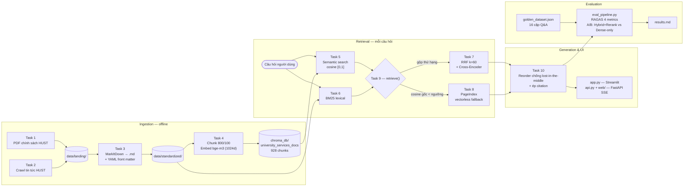

# Bài Tập Nhóm — University Services RAG Chatbot

## Mục Tiêu

Sau khi hoàn thành bài cá nhân, nhóm ngồi lại để xây dựng **1 trong 2 sản phẩm**:

---

## Yêu cầu 1: Sản phẩm nhóm RAG Chatbot

Xây dựng chatbot trả lời câu hỏi về dịch vụ và chính sách đại học liên quan.

**Yêu cầu:**
- Giao diện chat (Streamlit / Gradio / Chainlit)
- Trả lời có citation (dựa trên Task 10)
- Hỗ trợ follow-up questions (conversation memory)
- Hiển thị source documents đã dùng

**Stack gợi ý:**
```
Chainlit/Streamlit → Retrieval (Task 9) → Generation (Task 10) → Display
```

---

## Yêu cầu 2: RAG Evaluation Pipeline

Sử dụng **1 trong 3 framework** sau để evaluate pipeline RAG của nhóm:

### Framework lựa chọn

| Framework | Cài đặt | Đặc điểm |
|-----------|---------|-----------|
| [DeepEval](https://github.com/confident-ai/deepeval) | `pip install deepeval` | Nhiều metric built-in, dễ integrate với pytest |
| [RAGAS](https://github.com/explodinggradients/ragas) | `pip install ragas` | Chuẩn industry cho RAG eval, 3 trục chính |
| [TruLens](https://github.com/truera/trulens) | `pip install trulens` | Dashboard UI, feedback functions mạnh |

### Yêu cầu Evaluation

1. **Tạo Golden Dataset** — tối thiểu 15 cặp Q&A (question, expected_answer, expected_context)
2. **Chạy evaluation** trên toàn bộ golden dataset với các metrics sau:
   - **Faithfulness** — câu trả lời có bám đúng context không?
   - **Answer Relevance** — câu trả lời có đúng câu hỏi không?
   - **Context Recall** — retriever có lấy đủ evidence không?
   - **Context Precision** — trong context lấy về, bao nhiêu % thực sự hữu ích?
3. **So sánh A/B** — chạy eval trên ít nhất 2 config khác nhau (ví dụ: có reranking vs không reranking, hoặc hybrid vs dense-only)
4. **Báo cáo** — bảng điểm + phân tích worst performers + đề xuất cải tiến

Xem code mẫu (DeepEval/RAGAS/TruLens) chi tiết trong `README.md` gốc mục "Yêu cầu 2".

### Deliverable Evaluation

- [ ] File `group_project/evaluation/golden_dataset.json` — 15+ cặp Q&A
- [ ] File `group_project/evaluation/eval_pipeline.py` — script chạy evaluation
- [ ] File `group_project/evaluation/results.md` — bảng điểm + phân tích
- [ ] So sánh A/B ít nhất 2 configs

---

## Yêu Cầu Chung

1. **Tích hợp pipeline** từ bài cá nhân của các thành viên
2. **Demo hoạt động được** trong buổi trình bày (chạy local hoặc deploy)
3. **Evaluation pipeline** chạy được và có báo cáo kết quả
4. **Code push lên repository** chung của nhóm
5. **README** mô tả kiến trúc và phân công (điền bên dưới)

---

## Kiến Trúc Hệ Thống



Hai điểm thiết kế đáng chú ý:

1. **Ngưỡng fallback so trên điểm Cosine gốc, không phải điểm RRF.** Điểm RRF luôn rất nhỏ
   (~0.016) nên nếu đem so với ngưỡng thì nhánh PageIndex sẽ không bao giờ chạy.
2. **Reorder `front + back[::-1]` trước khi nhét vào prompt** để 2 chunk điểm cao nhất nằm ở
   đầu và cuối context — đúng 2 vị trí LLM chú ý nhất (*Lost in the Middle*, Liu et al. 2023).

Hợp đồng dữ liệu chi tiết giữa các Task: xem [`TEAM_ARCHITECTURE.md`](../TEAM_ARCHITECTURE.md).

---

## Phân Công Công Việc

| Thành viên | MSSV | Nhiệm vụ | Trạng thái |
|-----------|------|----------|------------|
| **Nguyễn Gia Bảo** | 2A202601938 | **Role 1** — Team Leader & RAG Architect: điều phối pipeline, `task9_retrieval_pipeline.py` (hybrid merge + fallback) | Hoàn thành |
| **Nguyễn Tuấn Anh** | 2A202601669 | **Role 2** — Data & Dense Search: `task1`–`task5` (crawl PDF/tin tức, MarkItDown, chunking, indexing ChromaDB, semantic search) | Hoàn thành |
| **Nguyễn Lê Minh** | 2A202601573 | **Role 3** — Sparse Search & Reranking: `task6` (BM25), `task7` (RRF + Cross-Encoder), `task8` (PageIndex fallback) | Hoàn thành |
| **Đỗ Hùng Anh** | 2A202601175 | **Role 4** — Frontend & Generation: `task10` (reorder + citation), `app.py`, `api.py` + `web/` | Hoàn thành |
| **Nguyễn Thị Lý** | 2A202601962 | **Role 5** — Evaluation & QA: `golden_dataset.json`, `eval_pipeline.py` (RAGAS), báo cáo A/B `results.md` | Hoàn thành |
| **Nguyễn Thế Công** | 2A202601425 | **Role 5** — Evaluation & QA: golden dataset, chạy benchmark RAGAS, phân tích worst performers | Hoàn thành |

---

## Hướng Dẫn Chạy

```bash
# Cài đặt dependencies
pip install -r requirements.txt

# Chạy app
streamlit run app.py
# hoặc
chainlit run app.py
```

---

## Lưu ý

Hãy giữ lại repo này nếu như bạn học track 3 giai đoạn 2, chúng ta sẽ phát triển tiếp dự án lên knowledge graph để khắc phục các câu hỏi hóc búa khi có các câu hỏi khó.
